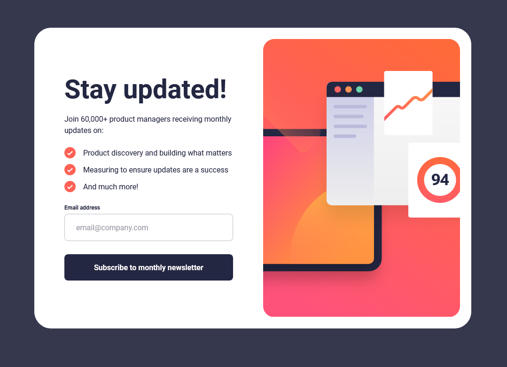
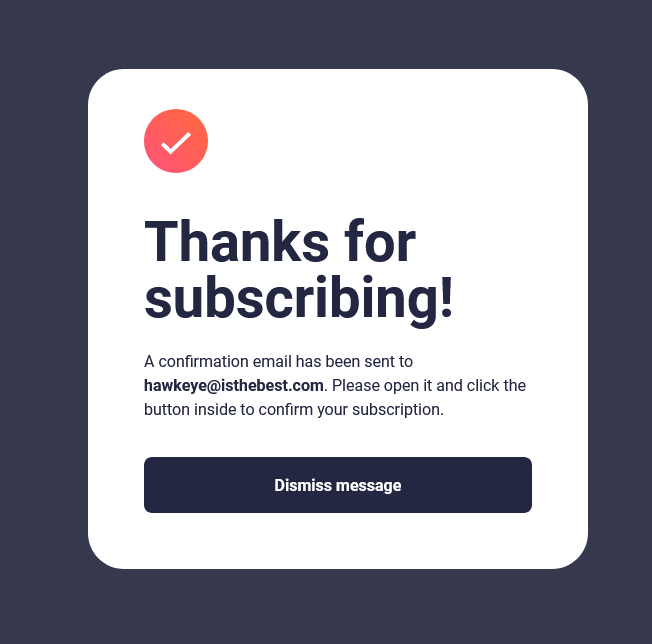
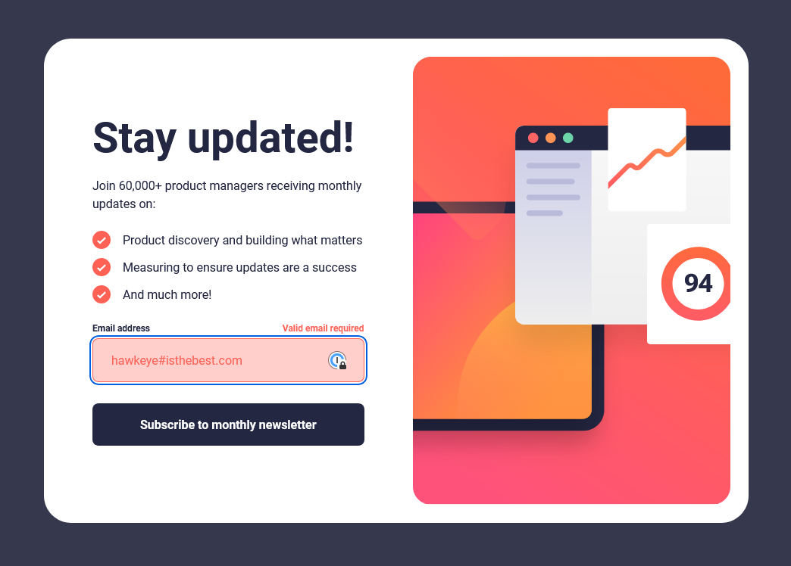
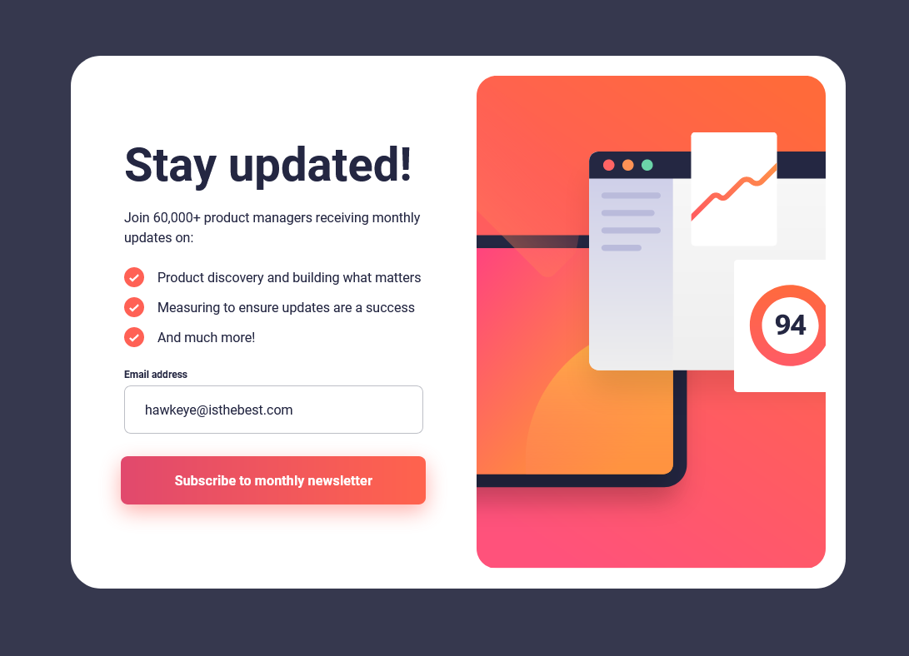

# Frontend Mentor - Newsletter sign-up form with success message solution

This is a solution to the [Newsletter sign-up form with success message challenge on Frontend Mentor](https://www.frontendmentor.io/challenges/newsletter-signup-form-with-success-message-3FC1AZbNrv). Frontend Mentor challenges help you improve your coding skills by building realistic projects.

## Table of contents

- [Frontend Mentor - Newsletter sign-up form with success message solution](#frontend-mentor---newsletter-sign-up-form-with-success-message-solution)
  - [Table of contents](#table-of-contents)
  - [Overview](#overview)
    - [The challenge](#the-challenge)
    - [Screenshot](#screenshot)
    - [Links](#links)
  - [My process](#my-process)
    - [Built with](#built-with)
    - [What I learned](#what-i-learned)
  - [Author](#author)

## Overview

### The challenge

Users should be able to:

- Add their email and submit the form
- See a success message with their email after successfully submitting the form
- See form validation messages if:
  - The field is left empty
  - The email address is not formatted correctly
- View the optimal layout for the interface depending on their device's screen size
- See hover and focus states for all interactive elements on the page

### Screenshot

### Links

- Solution URL: [GitHub repo](https://github.com/pbryan9/fm_newsletter_signup)
- Live Site URL: [Netlify deploy](https://main--fluffy-narwhal-eeb7cd.netlify.app/)

## My process

### Built with

- Semantic HTML5 markup
- CSS custom properties
- Flexbox
- CSS Grid
- Mobile-first workflow
- [React](https://reactjs.org/) - JS library
- [Styled Components](https://styled-components.com/) - For styles

### What I learned

This one was a little more fun than previous Frontend Mentor challenges that I've done. Turns out I really enjoy adding interactivity to a component.

I started out with a disabled state written up for the submit button, but I thought it detracted from the CTA nature of the button and so scrapped it (but the button is still
disabled and can't be clicked/hovered until a valid email is given).

I'm using standard React controlled forms for form state with a stolen bit of regex for validation.

## Author

- Website - [Patrick Bryan](https://pattyb.dev)
- Frontend Mentor - [@pbryan9](https://www.frontendmentor.io/profile/pbryan9)
